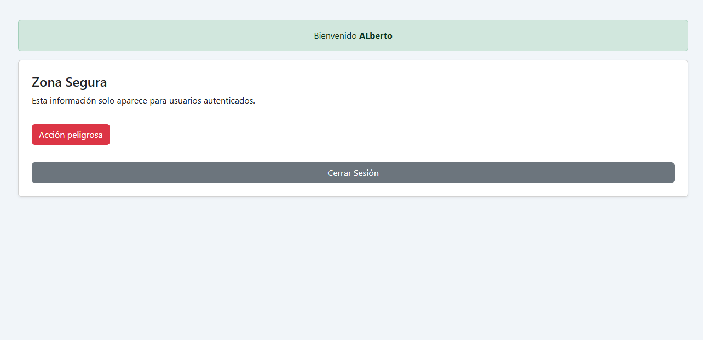
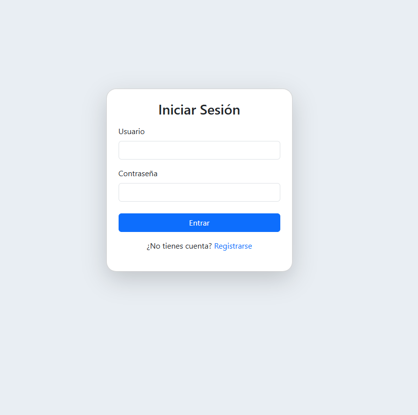
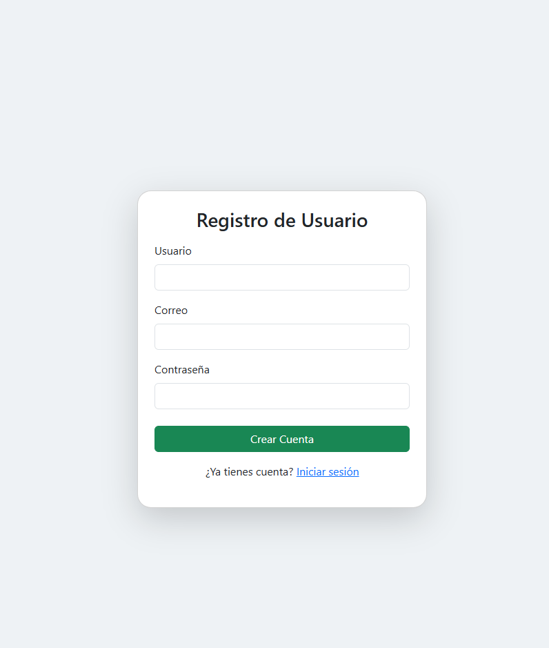

<div align="center">
  <h1>🔒 dwes-login-simple</h1>
  
</div>

Autenticación sencilla en PHP con buenas prácticas de seguridad, ideal para formación y proyectos DWES.

---

## ✨ Características
- Login y registro de usuarios
- Bloqueo tras varios intentos fallidos
- Expiración y regeneración segura de sesión
- Protección CSRF en formularios
- Panel seguro solo para usuarios autenticados

## 🚀 Instalación
1. Clona el repositorio:
   ```bash
   git clone https://github.com/albertogarciaquintana5-jpg/dwes-login-simple.git
   cd dwes-login-simple
   ```
2. Configura la base de datos:
   - Importa el archivo `migrations.sql` en tu base de datos MySQL.
   - Ajusta los datos de conexión en `db.php`.
3. Accede desde tu navegador a `index.php`.

## 🖼️ Capturas de pantalla

### Pantalla de inicio
Visualización tras iniciar sesión correctamente, mostrando el panel protegido.


### Login
Formulario para que los usuarios registrados accedan al sistema.


### Registro
Formulario para crear una nueva cuenta de usuario.


### Panel protegido
Solo accesible para usuarios autenticados.


## 🛡️ Seguridad
- Contraseñas cifradas con `password_hash()`
- Prevención de ataques CSRF y fuerza bruta
- Expiración y regeneración segura de sesión

## 📁 Estructura del proyecto
```
dwes-login-simple/
├── db.php
├── functions.php
├── index.php
├── inicio.png
├── login.png
├── logout.php
├── migrations.sql
├── protected.php
├── README.md
├── register.php
├── registro.png
├── sensitive_action.php
├── validation.js
```

## 👤 Autor
Alberto García Quintana

---
> **Nota:** Si tienes problemas, revisa la configuración de la base de datos y tu entorno PHP.
